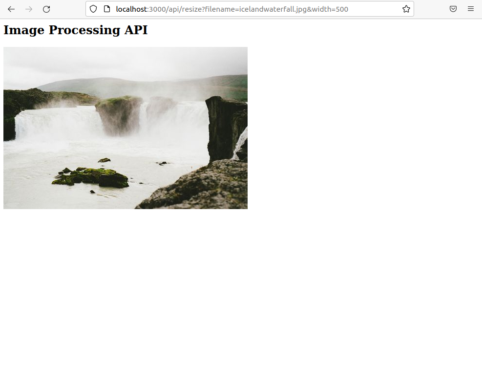

# FSJND - Image Processing API

---

### How to build

```shell
$ git clone https://github.com/raymondngiam/FSJND-ImageProcessingAPI.git
$ cd FSJND-ImageProcessingAPI
$ npm run build
$ npm run test
```

### Query the available images

Images available for the API can be queried as shown below:

```shell
$ ls src/public/images/
encenadaport.jpg  fjord.jpg  icelandwaterfall.jpg  palmtunnel.jpg  santamonica.jpg
```

Users may add any new images into this folder.


### App Walkthrough

1. We will be using the image `src/public/images/icelandwaterfall.jpg` in the following walkthrough.

    

1. Run the server.

    ```shell
    $ npm run build
    $ node dist/.
    Server started at http://localhost:3000
    ```

1. Open a browser and enter the url below to resize the image to width `500` and height `500`.

    ```
    http://localhost:3000/api/resize?filename=icelandwaterfall.jpg&width=500&height=500
    ```

    

    The server logging corresponding to this is as follows:

    ```shell
    request: /?filename=icelandwaterfall.jpg&width=500&height=500
    Serve newly resized image.
    Image filename: thumbnails/icelandwaterfall_500_500.jpg
    ```

1. Alternatively, we can input only one of the dimension query (`width` or `height`), whereby the other will be inferred (to match the aspect ratio of the input image). This time we resize the image with only the `width=500` query, as per the url below:

    ```
    http://localhost:3000/api/resize?filename=icelandwaterfall.jpg&width=500
    ```

    

    The server logging corresponding to this is as follows: 

    ```shell
    request: /?filename=icelandwaterfall.jpg&width=500
    Serve newly resized image.
    Image filename: thumbnails/icelandwaterfall_500_332.jpg
    ```

1. If we were to send a previous request to the api, the image will not be processed althogether again. Instead, a cached copy will be returned.

    ```
    http://localhost:3000/api/resize?filename=icelandwaterfall.jpg&width=500&height=500
    ```

    

    The server logging corresponding to this is as follows: 

    ```shell
    request: /?filename=icelandwaterfall.jpg&width=500&height=500
    Serve cached image.
    Image filename: thumbnails/icelandwaterfall_500_500.jpg
    ```

